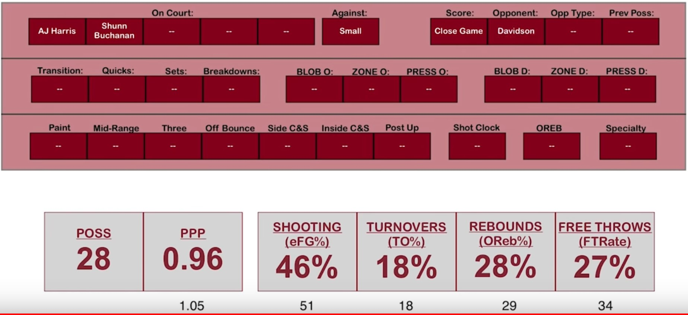

# Steps
- [X] Have datatype to represent a game
- [X] Parse game file into datatype
- [ ] Define all relevant queries on that datatype
  - [X] PPP (points per possession)
  - [X] eFG%
  - [X] TO%
  - [X] OReb%
  - [X] FTA/FGA
  - [ ] Shots at rim %
  - [ ] Rim FG%
  - [ ] Shots from three %
  - [ ] 3FG%
  - [ ] DReb%
  - [ ] FT%
- [ ] Game files have teams in header and are used in parse
- [ ] Game files have (optional?) substitution information, and thus plays have list of players in the game
- [ ] Use a lexer to ignore surrounding (or likely just trailing) whitespace
- [ ] Allow comments anywhere in the game logs
- [ ] Optimize parser, refactoring to avoid `try` function

# Goals
- **TO%**
- **eFG%**
- **Points per possession (PPP)** 
- **OReb%**
- **FTRate**
- Shots at rim %
- Shots from three %
- Can track these team metrics with specific lineups, opposing teams, etc.

# Ideas
- Four factors of basketball success (Dean Oliver):
  - **Shooting** *(eFG%)*
  - **Turnovers** *(TO%)*
  - **Rebounding** *(OReb%)*
  - **Free Throws** *(FTA/FGA)*
- Could say there are eight, because you multiply those by two for offense/defense
- These inherently cover the entire game of basketball, which is what my logging does. They are the *possession enders*
  - Another possession ender might be the clock running out
- Eventually, game logs will have player information, and each play in the data structure will have the list of players in the game

# Other
- I ran into an interesting situation: a player shot a three and the ball got wedged between the rim and backboard. That's a jumpball, so is it a OR or DR? The possession changed so a DR made more sense but if the possession had stayed it would've been quite weird to mark it as an OR
- Also, blocked shots are kind of different from normal shots, but idk how to represent them. A shot-OR resets the shot clock whereas a block-OR does not